# LES / MECT Integration — Flow Diagrams (Mermaid)

Use these diagrams to derive sequence diagrams and to explain states, events, and integration flows.

---

## 1. Enrollment state machine (LES)

Enrollment status and allowed transitions. Triggers are either **user/API action** (LES) or **Kafka event consumed** (LES).

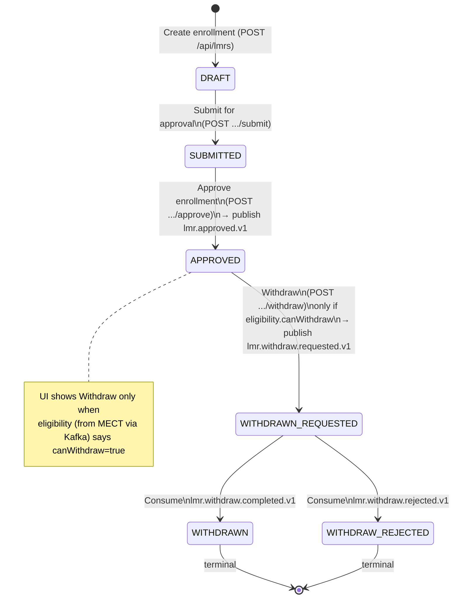
```mermaid
stateDiagram-v2
    [*] --> DRAFT : Create enrollment (POST /api/lmrs)

    DRAFT --> SUBMITTED : Submit for approval\n(POST .../submit)

    SUBMITTED --> APPROVED : Approve enrollment\n(POST .../approve)\n→ publish lmr.approved.v1

    APPROVED --> WITHDRAWN_REQUESTED : Withdraw\n(POST .../withdraw)\nonly if eligibility.canWithdraw\n→ publish lmr.withdraw.requested.v1

    WITHDRAWN_REQUESTED --> WITHDRAWN : Consume\nlmr.withdraw.completed.v1
    WITHDRAWN_REQUESTED --> WITHDRAW_REJECTED : Consume\nlmr.withdraw.rejected.v1

    WITHDRAWN --> [*] : terminal
    WITHDRAW_REJECTED --> [*] : terminal

    note right of APPROVED
        UI shows Withdraw only when
        eligibility (from MECT via Kafka) says canWithdraw=true
    end note
```

---

## 2. LMR state in MECT (authoritative)

MECT owns LMR lifecycle and blocking flags. Withdrawal outcome is decided here.

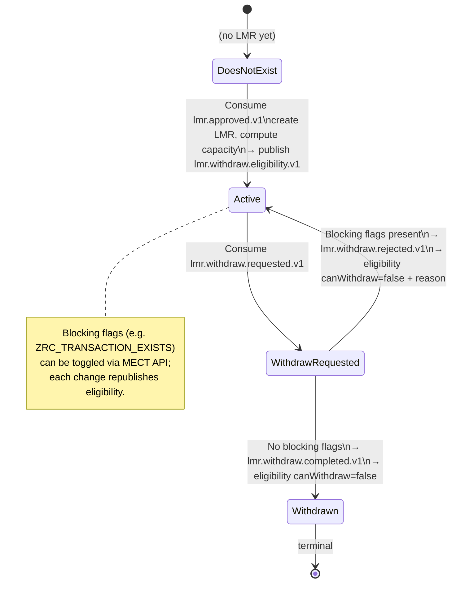
```mermaid
stateDiagram-v2
    [*] --> DoesNotExist : (no LMR yet)

    DoesNotExist --> Active : Consume lmr.approved.v1\ncreate LMR, compute capacity\n→ publish lmr.withdraw.eligibility.v1

    Active --> WithdrawRequested : Consume lmr.withdraw.requested.v1

    WithdrawRequested --> Withdrawn : No blocking flags\n→ lmr.withdraw.completed.v1\n→ eligibility canWithdraw=false
    WithdrawRequested --> Active : Blocking flags present\n→ lmr.withdraw.rejected.v1\n→ eligibility canWithdraw=false + reason

    Withdrawn --> [*] : terminal

    note right of Active
        Blocking flags (e.g. ZRC_TRANSACTION_EXISTS)
        can be toggled via MECT API;
        each change republishes eligibility.
    end note
```

---

## 3. End-to-end integration flow (swimlanes)

Shows who does what and where events go. Use this to derive a sequence diagram.

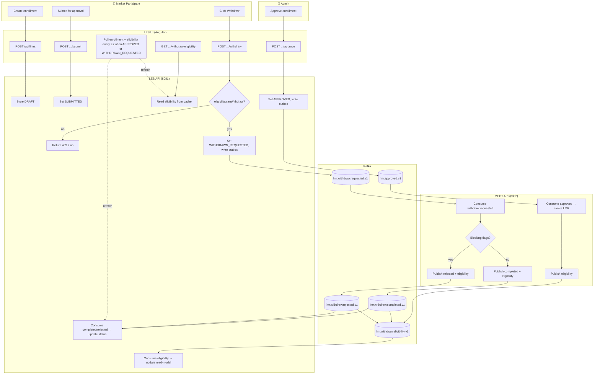
```mermaid
flowchart TB
    subgraph MP ["👤 Market Participant"]
        A1[Create enrollment]
        A2[Submit for approval]
        A4[Click Withdraw]
    end

    subgraph Admin ["👤 Admin"]
        A3[Approve enrollment]
    end

    subgraph LES_UI ["LES UI (Angular)"]
        U1[POST /api/lmrs]
        U2[POST .../submit]
        U3[POST .../approve]
        U4[GET .../withdraw-eligibility]
        U5[POST .../withdraw]
        U6[Poll enrollment + eligibility every 2s when APPROVED or WITHDRAWN_REQUESTED]
    end

    subgraph LES_API ["LES API (8081)"]
        L1[Store DRAFT]
        L2[Set SUBMITTED]
        L3[Set APPROVED, write outbox]
        L4[Read eligibility from cache]
        L5{eligibility.canWithdraw?}
        L6[Return 409 if no]
        L7[Set WITHDRAWN_REQUESTED, write outbox]
        L8[Consume completed/rejected → update status]
        L9[Consume eligibility → update read-model]
    end

    subgraph Kafka ["Kafka"]
        K1[(lmr.approved.v1)]
        K2[(lmr.withdraw.requested.v1)]
        K3[(lmr.withdraw.eligibility.v1)]
        K4[(lmr.withdraw.completed.v1)]
        K5[(lmr.withdraw.rejected.v1)]
    end

    subgraph MECT_API ["MECT API (8082)"]
        M1[Consume approved → create LMR]
        M2[Publish eligibility]
        M3[Consume withdraw.requested]
        M4{Blocking flags?}
        M5[Publish completed + eligibility]
        M6[Publish rejected + eligibility]
    end

    A1 --> U1 --> L1
    A2 --> U2 --> L2
    A3 --> U3 --> L3 --> K1
    K1 --> M1 --> M2 --> K3
    K3 --> L9

    U4 --> L4
    A4 --> U5 --> L5
    L5 -->|no| L6
    L5 -->|yes| L7 --> K2
    K2 --> M3 --> M4
    M4 -->|no| M5 --> K4 --> K3
    M4 -->|yes| M6 --> K5 --> K3
    K4 --> L8
    K5 --> L8

    U6 -.->|refetch| L4
    U6 -.->|refetch| L8
```

---

## 4. Event flow (who publishes / who consumes)

Use this to annotate a sequence diagram with topic names and direction.

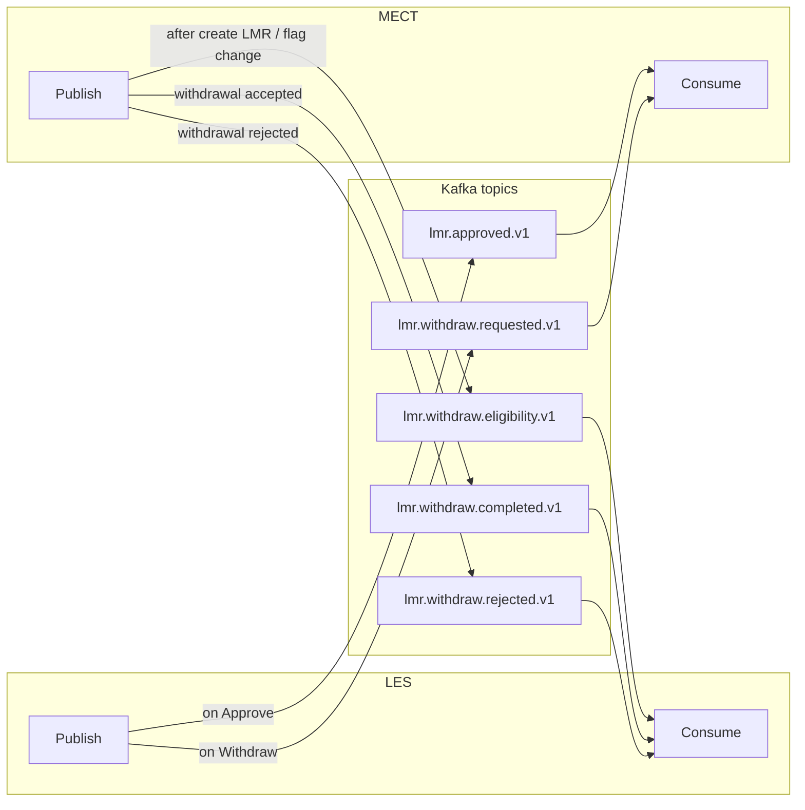
```mermaid
flowchart LR
    subgraph LES ["LES"]
        LES_PUB[Publish]
        LES_CONS[Consume]
    end

    subgraph Kafka ["Kafka topics"]
        T1[lmr.approved.v1]
        T2[lmr.withdraw.requested.v1]
        T3[lmr.withdraw.eligibility.v1]
        T4[lmr.withdraw.completed.v1]
        T5[lmr.withdraw.rejected.v1]
    end

    subgraph MECT ["MECT"]
        MECT_PUB[Publish]
        MECT_CONS[Consume]
    end

    LES_PUB -->|on Approve| T1
    LES_PUB -->|on Withdraw| T2
    T1 --> MECT_CONS
    T2 --> MECT_CONS

    MECT_PUB -->|after create LMR / flag change| T3
    MECT_PUB -->|withdrawal accepted| T4
    MECT_PUB -->|withdrawal rejected| T5
    T3 --> LES_CONS
    T4 --> LES_CONS
    T5 --> LES_CONS
```

---

## 5. Step-by-step flows for sequence diagrams

### 5a. Approval flow (market participant creates and submits, admin approves → eligibility available)

| Step | Actor | Action | Notes for sequence diagram |
|------|--------|--------|-----------------------------|
| 1 | Market Participant | Create enrollment (form) | LES UI → LES API: POST /api/lmrs |
| 2 | LES API | Persist enrollment, status = DRAFT | Response 201 |
| 3 | Market Participant | Submit for approval | LES UI → LES API: POST .../submit |
| 4 | LES API | Set status = SUBMITTED | Response 200 |
| 5 | Admin | Approve enrollment | LES UI → LES API: POST .../approve |
| 6 | LES API | Set status = APPROVED, write outbox | Response 200 (enrollment) |
| 7 | LES (outbox job) | Publish lmr.approved.v1 to Kafka | Async |
| 8 | MECT | Consume lmr.approved.v1 | Create LMR, compute capacity |
| 9 | MECT | Publish lmr.withdraw.eligibility.v1 | canWithdraw=true (typically) |
| 10 | LES | Consume lmr.withdraw.eligibility.v1 | Update eligibility read-model |
| 11 | LES UI | Poll GET .../withdraw-eligibility | Sees canWithdraw=true, shows Withdraw button |

### 5b. Withdrawal — happy path (eligible, MECT accepts)

| Step | Actor | Action | Notes for sequence diagram |
|------|--------|--------|-----------------------------|
| 1 | Market Participant | Click Withdraw | LES UI → LES API: POST .../withdraw |
| 2 | LES API | Check local eligibility; if canWithdraw, set WITHDRAWN_REQUESTED, write outbox | Response 200 (enrollment) |
| 3 | LES (outbox job) | Publish lmr.withdraw.requested.v1 to Kafka | Async |
| 4 | MECT | Consume lmr.withdraw.requested.v1 | Check blocking flags |
| 5 | MECT | No flags → mark LMR withdrawn, publish lmr.withdraw.completed.v1 and eligibility (canWithdraw=false) | |
| 6 | LES | Consume lmr.withdraw.completed.v1 | Set status = WITHDRAWN |
| 7 | LES | Consume lmr.withdraw.eligibility.v1 | Update read-model |
| 8 | LES UI | Poll GET .../lmrs/{id} | Sees status WITHDRAWN, stops polling, shows success |

### 5c. Withdrawal — rejected (MECT has blocking flags)

| Step | Actor | Action | Notes for sequence diagram |
|------|--------|--------|-----------------------------|
| 1–3 | (same as 5b) | Market Participant withdraws, LES sets WITHDRAWN_REQUESTED, publishes lmr.withdraw.requested.v1 | |
| 4 | MECT | Consume lmr.withdraw.requested.v1 | Check blocking flags |
| 5 | MECT | Flags present → publish lmr.withdraw.rejected.v1 + eligibility (canWithdraw=false, reason) | |
| 6 | LES | Consume lmr.withdraw.rejected.v1 | Set status = WITHDRAW_REJECTED, store reason |
| 7 | LES | Consume lmr.withdraw.eligibility.v1 | Update read-model |
| 8 | LES UI | Poll GET .../lmrs/{id} | Sees WITHDRAW_REJECTED, shows rejection message |

### 5d. Withdrawal — blocked at LES (cached eligibility says no)

| Step | Actor | Action | Notes for sequence diagram |
|------|--------|--------|-----------------------------|
| 1 | Market Participant | Attempt withdraw (or API call) | LES UI → LES API: POST .../withdraw |
| 2 | LES API | Check local eligibility; canWithdraw=false | Response **409** with reason (no event published) |
| 3 | LES UI | Show error / no button | Withdraw button not shown when eligibility says no |

### 5e. Eligibility update (MECT flag toggled)

| Step | Actor | Action | Notes for sequence diagram |
|------|--------|--------|-----------------------------|
| 1 | Admin / system | Enable or disable blocking flag via MECT API | MECT API: POST .../flags/.../enable or .../disable |
| 2 | MECT | Recompute eligibility, publish lmr.withdraw.eligibility.v1 | canWithdraw + message |
| 3 | LES | Consume lmr.withdraw.eligibility.v1 | Update read-model |
| 4 | LES UI | Poll GET .../withdraw-eligibility | Button or message updates without refresh |

---

## 6. Simplified sequence-style flow (one diagram)

High-level order of operations: market participant creates and submits; admin approves; market participant may withdraw when eligible.

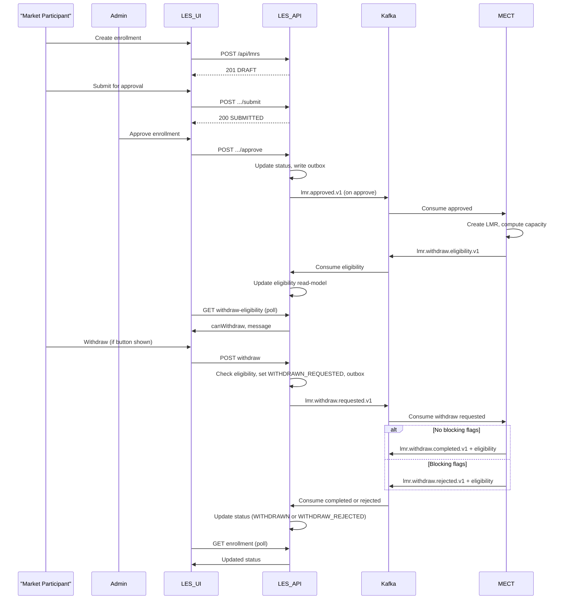
```mermaid
sequenceDiagram
    participant MP as "Market Participant"
    participant Admin
    participant LES_UI
    participant LES_API
    participant Kafka
    participant MECT

    MP->>LES_UI: Create enrollment
    LES_UI->>LES_API: POST /api/lmrs
    LES_API-->>LES_UI: 201 DRAFT
    MP->>LES_UI: Submit for approval
    LES_UI->>LES_API: POST .../submit
    LES_API-->>LES_UI: 200 SUBMITTED
    Admin->>LES_UI: Approve enrollment
    LES_UI->>LES_API: POST .../approve
    LES_API->>LES_API: Update status, write outbox
    LES_API->>Kafka: lmr.approved.v1 (on approve)
    Kafka->>MECT: Consume approved
    MECT->>MECT: Create LMR, compute capacity
    MECT->>Kafka: lmr.withdraw.eligibility.v1
    Kafka->>LES_API: Consume eligibility
    LES_API->>LES_API: Update eligibility read-model
    LES_UI->>LES_API: GET withdraw-eligibility (poll)
    LES_API->>LES_UI: canWithdraw, message

    MP->>LES_UI: Withdraw (if button shown)
    LES_UI->>LES_API: POST withdraw
    LES_API->>LES_API: Check eligibility, set WITHDRAWN_REQUESTED, outbox
    LES_API->>Kafka: lmr.withdraw.requested.v1
    Kafka->>MECT: Consume withdraw requested
    alt No blocking flags
        MECT->>Kafka: lmr.withdraw.completed.v1 + eligibility
    else Blocking flags
        MECT->>Kafka: lmr.withdraw.rejected.v1 + eligibility
    end
    Kafka->>LES_API: Consume completed or rejected
    LES_API->>LES_API: Update status (WITHDRAWN or WITHDRAW_REJECTED)
    LES_UI->>LES_API: GET enrollment (poll)
    LES_API->>LES_UI: Updated status
```

---

## 7. UI decision flow (what to show)

Use this when documenting the UI layer in a sequence or flow.

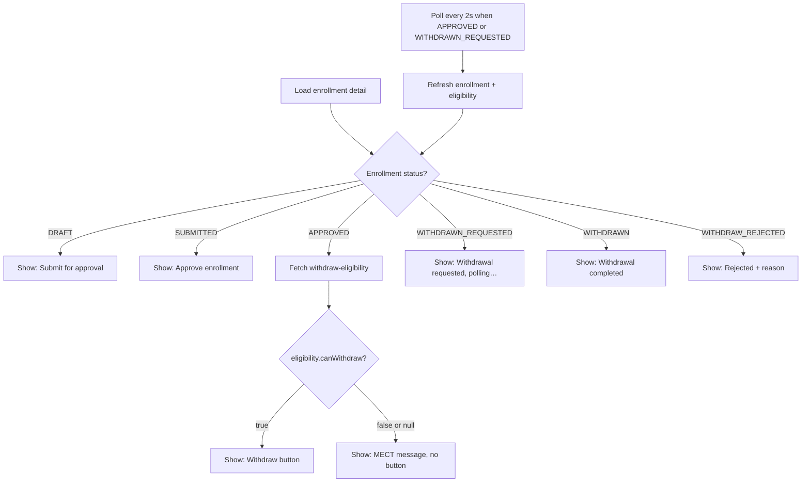
```mermaid
flowchart TD
    LOAD[Load enrollment detail]
    LOAD --> STATUS{Enrollment status?}

    STATUS -->|DRAFT| SHOW_SUBMIT[Show: Submit for approval]
    STATUS -->|SUBMITTED| SHOW_APPROVE[Show: Approve enrollment]
    STATUS -->|APPROVED| FETCH_EL[Fetch withdraw-eligibility]
    STATUS -->|WITHDRAWN_REQUESTED| SHOW_PENDING[Show: Withdrawal requested, polling…]
    STATUS -->|WITHDRAWN| SHOW_DONE[Show: Withdrawal completed]
    STATUS -->|WITHDRAW_REJECTED| SHOW_REJ[Show: Rejected + reason]

    FETCH_EL --> EL{eligibility.canWithdraw?}
    EL -->|true| SHOW_WITHDRAW[Show: Withdraw button]
    EL -->|false or null| SHOW_MSG[Show: MECT message, no button]

    POLL[Poll every 2s when APPROVED or WITHDRAWN_REQUESTED]
    POLL --> REFRESH[Refresh enrollment + eligibility]
    REFRESH --> STATUS
```

---

## 8. Sequence diagrams by scenario

One sequence diagram per scenario for reuse in docs or slides.

### 8a. Approval flow (market participant creates and submits, admin approves, MECT creates LMR)

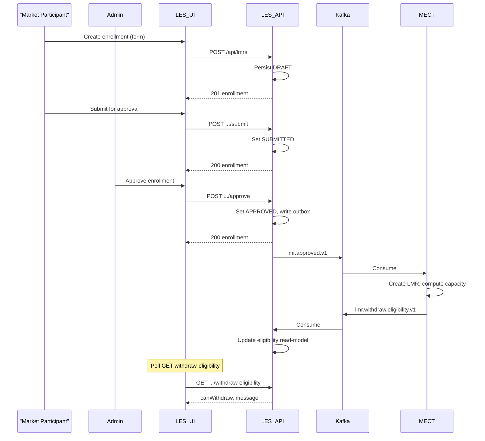
```mermaid
sequenceDiagram
    participant MP as "Market Participant"
    participant Admin
    participant LES_UI
    participant LES_API
    participant Kafka
    participant MECT

    MP->>LES_UI: Create enrollment (form)
    LES_UI->>LES_API: POST /api/lmrs
    LES_API->>LES_API: Persist DRAFT
    LES_API-->>LES_UI: 201 enrollment

    MP->>LES_UI: Submit for approval
    LES_UI->>LES_API: POST .../submit
    LES_API->>LES_API: Set SUBMITTED
    LES_API-->>LES_UI: 200 enrollment

    Admin->>LES_UI: Approve enrollment
    LES_UI->>LES_API: POST .../approve
    LES_API->>LES_API: Set APPROVED, write outbox
    LES_API-->>LES_UI: 200 enrollment
    LES_API->>Kafka: lmr.approved.v1
    Kafka->>MECT: Consume
    MECT->>MECT: Create LMR, compute capacity
    MECT->>Kafka: lmr.withdraw.eligibility.v1
    Kafka->>LES_API: Consume
    LES_API->>LES_API: Update eligibility read-model

    Note over LES_UI: Poll GET withdraw-eligibility
    LES_UI->>LES_API: GET .../withdraw-eligibility
    LES_API-->>LES_UI: canWithdraw, message
```

### 8b. Withdraw — happy path (eligible, MECT accepts)

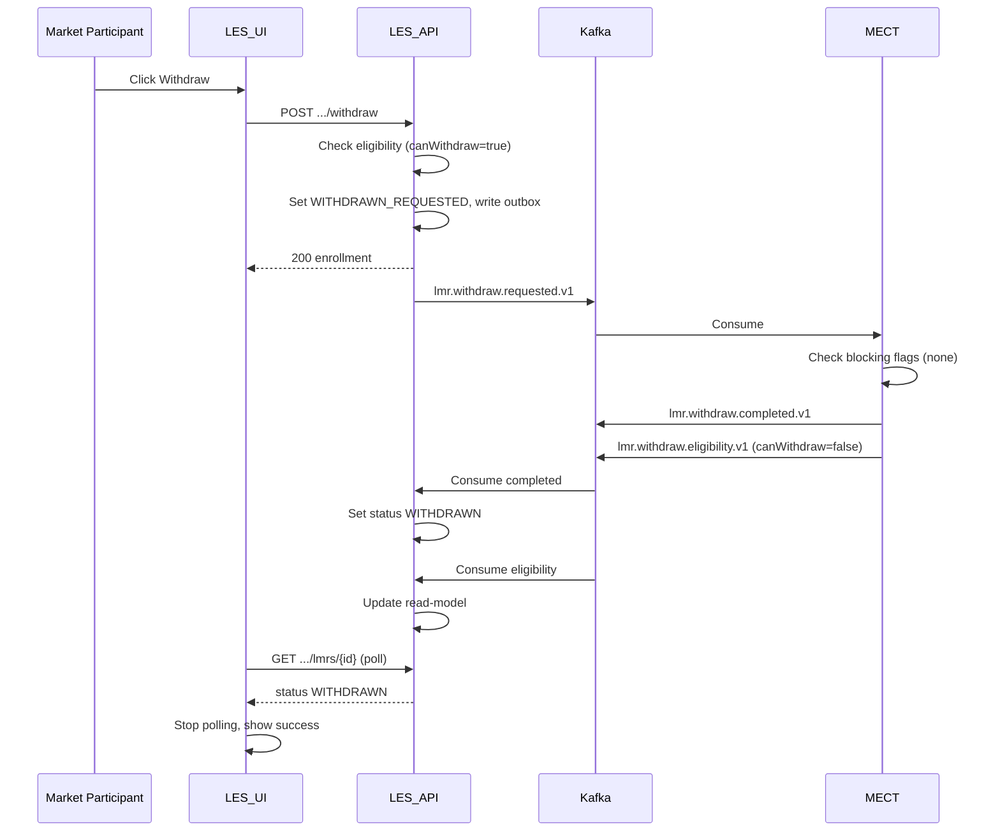
```mermaid
sequenceDiagram
    participant Market Participant
    participant LES_UI
    participant LES_API
    participant Kafka
    participant MECT

    Market Participant->>LES_UI: Click Withdraw
    LES_UI->>LES_API: POST .../withdraw
    LES_API->>LES_API: Check eligibility (canWithdraw=true)
    LES_API->>LES_API: Set WITHDRAWN_REQUESTED, write outbox
    LES_API-->>LES_UI: 200 enrollment
    LES_API->>Kafka: lmr.withdraw.requested.v1
    Kafka->>MECT: Consume
    MECT->>MECT: Check blocking flags (none)
    MECT->>Kafka: lmr.withdraw.completed.v1
    MECT->>Kafka: lmr.withdraw.eligibility.v1 (canWithdraw=false)
    Kafka->>LES_API: Consume completed
    LES_API->>LES_API: Set status WITHDRAWN
    Kafka->>LES_API: Consume eligibility
    LES_API->>LES_API: Update read-model
    LES_UI->>LES_API: GET .../lmrs/{id} (poll)
    LES_API-->>LES_UI: status WITHDRAWN
    LES_UI->>LES_UI: Stop polling, show success
```

### 8c. Withdraw — rejected by MECT (blocking flags)

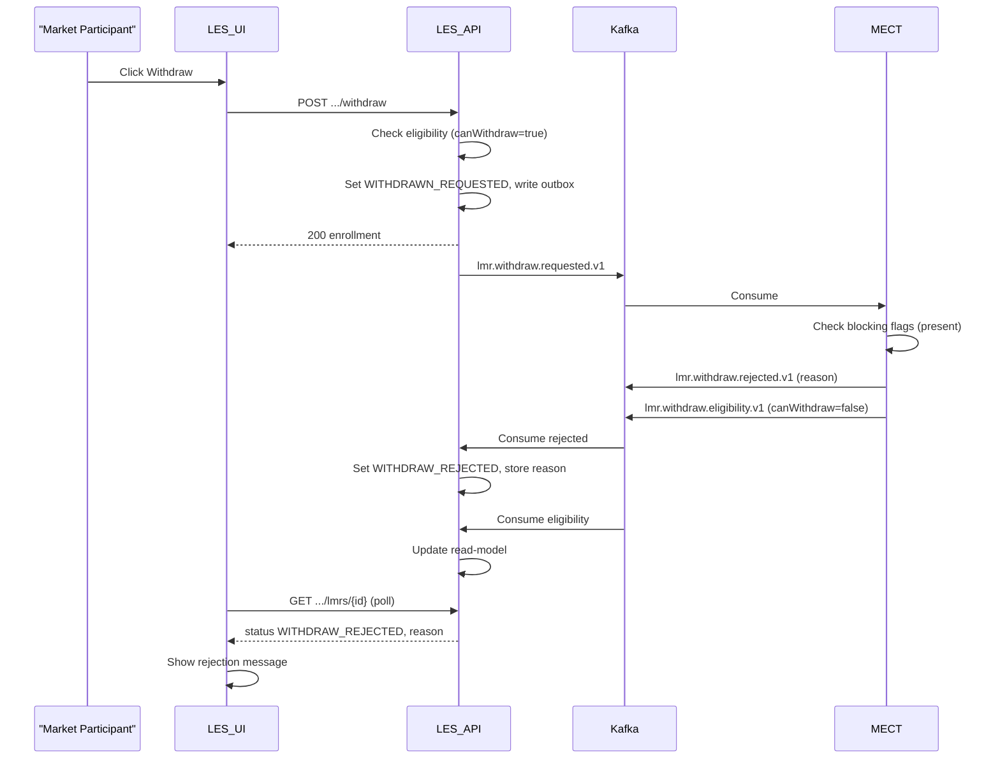
```mermaid
sequenceDiagram
    participant MP as "Market Participant"
    participant LES_UI
    participant LES_API
    participant Kafka
    participant MECT

    MP->>LES_UI: Click Withdraw
    LES_UI->>LES_API: POST .../withdraw
    LES_API->>LES_API: Check eligibility (canWithdraw=true)
    LES_API->>LES_API: Set WITHDRAWN_REQUESTED, write outbox
    LES_API-->>LES_UI: 200 enrollment
    LES_API->>Kafka: lmr.withdraw.requested.v1
    Kafka->>MECT: Consume
    MECT->>MECT: Check blocking flags (present)
    MECT->>Kafka: lmr.withdraw.rejected.v1 (reason)
    MECT->>Kafka: lmr.withdraw.eligibility.v1 (canWithdraw=false)
    Kafka->>LES_API: Consume rejected
    LES_API->>LES_API: Set WITHDRAW_REJECTED, store reason
    Kafka->>LES_API: Consume eligibility
    LES_API->>LES_API: Update read-model
    LES_UI->>LES_API: GET .../lmrs/{id} (poll)
    LES_API-->>LES_UI: status WITHDRAW_REJECTED, reason
    LES_UI->>LES_UI: Show rejection message
```

### 8d. Withdraw — blocked at LES (409, no event)

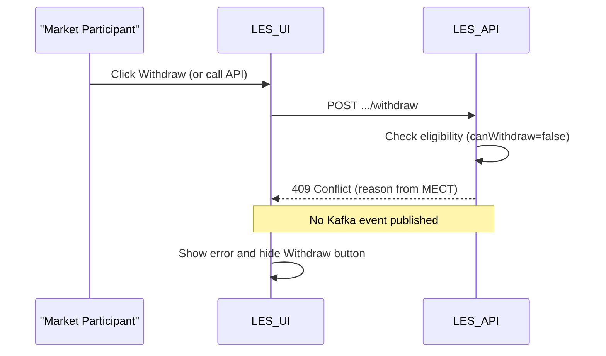
```mermaid
sequenceDiagram
    participant MP as "Market Participant"
    participant LES_UI
    participant LES_API

    MP->>LES_UI: Click Withdraw (or call API)
    LES_UI->>LES_API: POST .../withdraw
    LES_API->>LES_API: Check eligibility (canWithdraw=false)
    LES_API-->>LES_UI: 409 Conflict (reason from MECT)
    Note over LES_UI,LES_API: No Kafka event published
    LES_UI->>LES_UI: Show error and hide Withdraw button
```

### 8e. Eligibility not yet available (UI polls after admin approves)

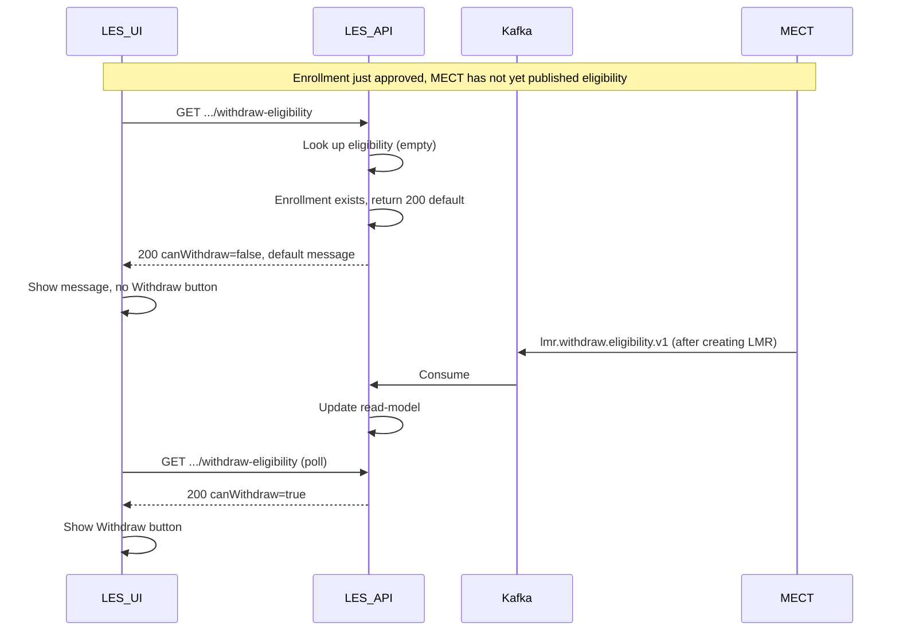
```mermaid
sequenceDiagram
    participant LES_UI
    participant LES_API
    participant Kafka
    participant MECT

    Note over LES_UI,MECT: Enrollment just approved, MECT has not yet published eligibility
    LES_UI->>LES_API: GET .../withdraw-eligibility
    LES_API->>LES_API: Look up eligibility (empty)
    LES_API->>LES_API: Enrollment exists, return 200 default
    LES_API-->>LES_UI: 200 canWithdraw=false, default message
    LES_UI->>LES_UI: Show message, no Withdraw button
    MECT->>Kafka: lmr.withdraw.eligibility.v1 (after creating LMR)
    Kafka->>LES_API: Consume
    LES_API->>LES_API: Update read-model
    LES_UI->>LES_API: GET .../withdraw-eligibility (poll)
    LES_API-->>LES_UI: 200 canWithdraw=true
    LES_UI->>LES_UI: Show Withdraw button
```

### 8f. Admin toggles blocking flag (MECT API → eligibility update)

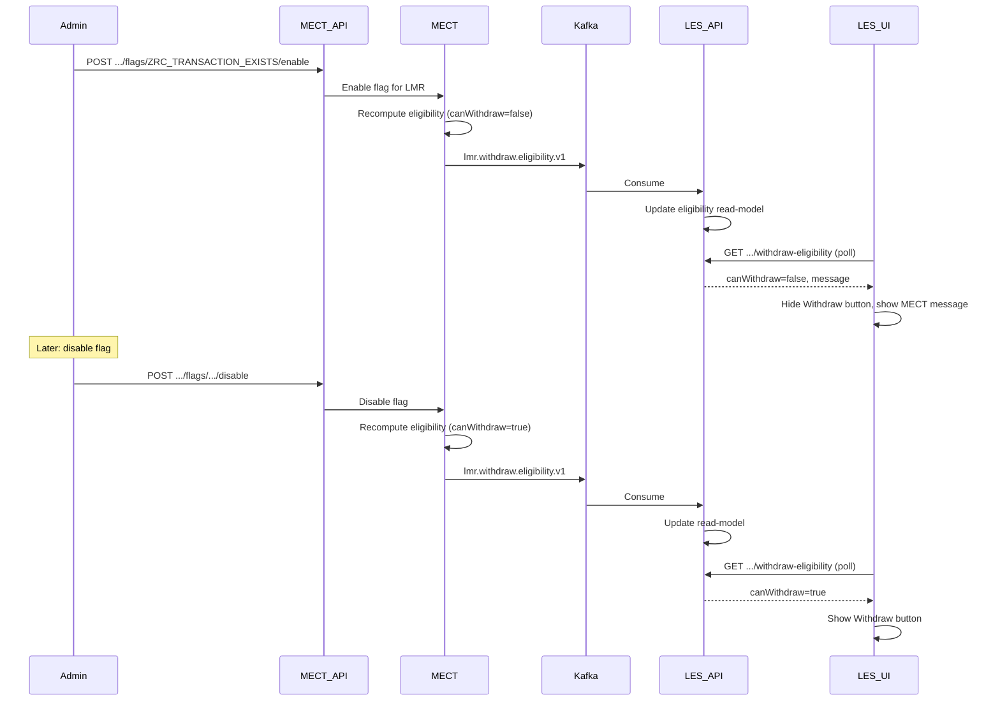
```mermaid
sequenceDiagram
    participant Admin
    participant MECT_API
    participant MECT
    participant Kafka
    participant LES_API
    participant LES_UI

    Admin->>MECT_API: POST .../flags/ZRC_TRANSACTION_EXISTS/enable
    MECT_API->>MECT: Enable flag for LMR
    MECT->>MECT: Recompute eligibility (canWithdraw=false)
    MECT->>Kafka: lmr.withdraw.eligibility.v1
    Kafka->>LES_API: Consume
    LES_API->>LES_API: Update eligibility read-model
    LES_UI->>LES_API: GET .../withdraw-eligibility (poll)
    LES_API-->>LES_UI: canWithdraw=false, message
    LES_UI->>LES_UI: Hide Withdraw button, show MECT message

    Note over Admin: Later: disable flag
    Admin->>MECT_API: POST .../flags/.../disable
    MECT_API->>MECT: Disable flag
    MECT->>MECT: Recompute eligibility (canWithdraw=true)
    MECT->>Kafka: lmr.withdraw.eligibility.v1
    Kafka->>LES_API: Consume
    LES_API->>LES_API: Update read-model
    LES_UI->>LES_API: GET .../withdraw-eligibility (poll)
    LES_API-->>LES_UI: canWithdraw=true
    LES_UI->>LES_UI: Show Withdraw button
```

### 8g. Edge case: race (button shown, then admin adds flag in MECT, market participant withdraws → rejected)

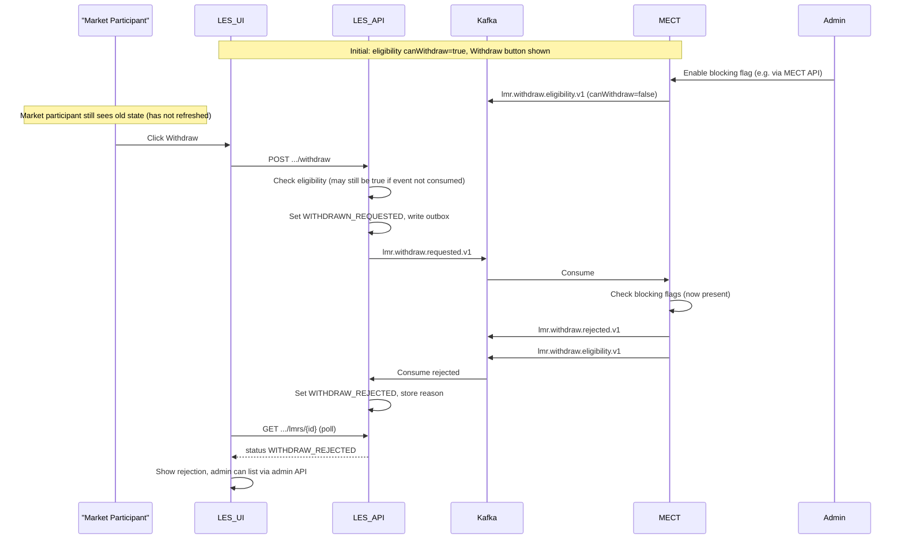
```mermaid
sequenceDiagram
    participant MP as "Market Participant"
    participant LES_UI
    participant LES_API
    participant Kafka
    participant MECT
    participant Admin

    Note over LES_UI,MECT: Initial: eligibility canWithdraw=true, Withdraw button shown
    Admin->>MECT: Enable blocking flag (e.g. via MECT API)
    MECT->>Kafka: lmr.withdraw.eligibility.v1 (canWithdraw=false)
    Note over MP: Market participant still sees old state (has not refreshed)
    MP->>LES_UI: Click Withdraw
    LES_UI->>LES_API: POST .../withdraw
    LES_API->>LES_API: Check eligibility (may still be true if event not consumed)
    LES_API->>LES_API: Set WITHDRAWN_REQUESTED, write outbox
    LES_API->>Kafka: lmr.withdraw.requested.v1
    Kafka->>MECT: Consume
    MECT->>MECT: Check blocking flags (now present)
    MECT->>Kafka: lmr.withdraw.rejected.v1
    MECT->>Kafka: lmr.withdraw.eligibility.v1
    Kafka->>LES_API: Consume rejected
    LES_API->>LES_API: Set WITHDRAW_REJECTED, store reason
    LES_UI->>LES_API: GET .../lmrs/{id} (poll)
    LES_API-->>LES_UI: status WITHDRAW_REJECTED
    LES_UI->>LES_UI: Show rejection, admin can list via admin API
```

### 8h. Full lifecycle (single diagram: create → approve → withdraw completed)

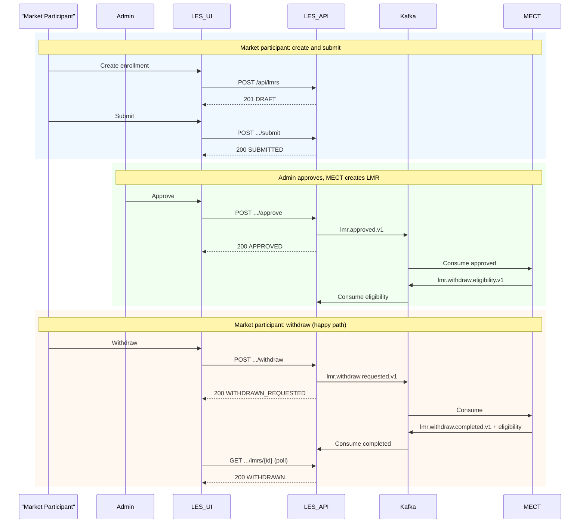
```mermaid
sequenceDiagram
    participant MP as "Market Participant"
    participant Admin
    participant LES_UI
    participant LES_API
    participant Kafka
    participant MECT

    rect rgb(240, 248, 255)
        Note over MP,MECT: Market participant: create and submit
        MP->>LES_UI: Create enrollment
        LES_UI->>LES_API: POST /api/lmrs
        LES_API-->>LES_UI: 201 DRAFT
        MP->>LES_UI: Submit
        LES_UI->>LES_API: POST .../submit
        LES_API-->>LES_UI: 200 SUBMITTED
    end

    rect rgb(240, 255, 240)
        Note over Admin,MECT: Admin approves, MECT creates LMR
        Admin->>LES_UI: Approve
        LES_UI->>LES_API: POST .../approve
        LES_API->>Kafka: lmr.approved.v1
        LES_API-->>LES_UI: 200 APPROVED
        Kafka->>MECT: Consume approved
        MECT->>Kafka: lmr.withdraw.eligibility.v1
        Kafka->>LES_API: Consume eligibility
    end

    rect rgb(255, 248, 240)
        Note over MP,MECT: Market participant: withdraw (happy path)
        MP->>LES_UI: Withdraw
        LES_UI->>LES_API: POST .../withdraw
        LES_API->>Kafka: lmr.withdraw.requested.v1
        LES_API-->>LES_UI: 200 WITHDRAWN_REQUESTED
        Kafka->>MECT: Consume
        MECT->>Kafka: lmr.withdraw.completed.v1 + eligibility
        Kafka->>LES_API: Consume completed
        LES_UI->>LES_API: GET .../lmrs/{id} (poll)
        LES_API-->>LES_UI: 200 WITHDRAWN
    end
```

---

## File location

- **Path**: `docs/integration-flow-diagrams.md`
- Render in any Mermaid-capable viewer (e.g. GitHub, GitLab, VS Code with Mermaid extension, or [mermaid.live](https://mermaid.live)).
